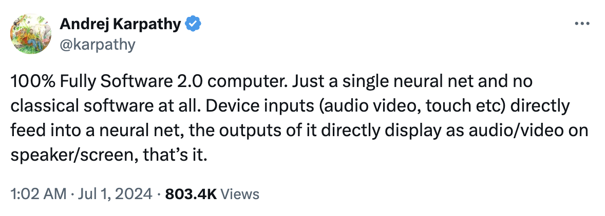
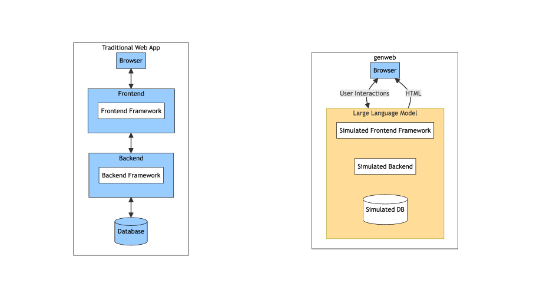

# 🧪 genweb: generative full stack web framework 🧪

### backend ❌ frontend ❌ database ❌ llm ✅

genweb allows you to build full stack applications with natrual language. Unlike other codegen tools, genweb generates the user interface html directly, without outputting any backend or frontend framework code.

Any user interactions are piped back to the llm, which "rerenders" the html as necessary, as a web framework like react would.

this is a proof of concept of software 2.0, and is not ready for production.

## Here's how genweb compares to traditional web development:

## Every user session is a multi-turn LLM conversation. Here's an example of a user session:

| Step | Content |
|--------------|---------|
| Application "source code" definition | You are an AI assistant simulating a web application. Below is the application I want you to simulate:  
A todo list application where users can: 1. Add new tasks 2. Mark tasks as complete 3. Delete tasks 4. Filter tasks by status (all, active, completed)
 Generate full HTML for this application. Always add CSS styling, but put it at the end of the body in a &lt;style&gt; tag. Follow these guidelines:... |
| Assistant generates initial HTML based on the application specification |  <pre style="background-color: #87CEEB; padding: 10px;">&lt;html&gt; &lt;head&gt;     &lt;title&gt;Todo List&lt;/title&gt; &lt;/head&gt; &lt;body&gt;     &lt;h1&gt;Todo List&lt;/h1&gt;     &lt;form id="todo-form"&gt;         &lt;input id="task-input" name="task"&gt;         &lt;button&gt;Add Task&lt;/button&gt;     &lt;/form&gt;     &lt;ul id="task-list"&gt;&lt;/ul&gt;     &lt;select id="filter-status"&gt;         &lt;option value="all"&gt;All&lt;/option&gt;         &lt;option value="active"&gt;Active&lt;/option&gt;         &lt;option value="completed"&gt;Completed&lt;/option&gt;     &lt;/select&gt; &lt;/body&gt; &lt;/html&gt;
</pre>User interaction - user adds task to todo list | The user interacted with the element with ID "todo-form". This element is part of a form, and the form data is: {"task":"buy fruit"}. Based on this interaction and the current state of the application, generate the appropriate full HTML content. Remember to include all necessary HTML tags and CSS styling. |
| LLM updates the HTML to include the new task "buy fruit" with options to mark it as complete or delete it. | <pre style="background-color: #87CEEB; padding: 10px;">&lt;html&gt; &lt;head&gt;     &lt;title&gt;Todo List&lt;/title&gt; &lt;/head&gt; &lt;body&gt;     &lt;h1&gt;Todo List&lt;/h1&gt;     &lt;form id="todo-form"&gt;         &lt;input id="task-input" name="task"&gt;         &lt;button&gt;Add Task&lt;/button&gt;     &lt;/form&gt;     &lt;ul id="task-list"&gt;         &lt;li&gt;             &lt;span&gt;New: buy fruit&lt;/span&gt;             &lt;button id="complete-0"&gt;Complete&lt;/button&gt;             &lt;button id="delete-0"&gt;Delete&lt;/button&gt;         &lt;/li&gt;     &lt;/ul&gt;     &lt;select id="filter-status"&gt;         &lt;option value="all"&gt;All&lt;/option&gt;         &lt;option value="active"&gt;Active&lt;/option&gt;         &lt;option value="completed"&gt;Completed&lt;/option&gt;     &lt;/select&gt; &lt;/body&gt; &lt;/html&gt;
</pre>User marks the task as complete | The user interacted with the element with ID "complete-0". Based on this interaction and the current state of the application, generate the appropriate full HTML content. Remember to include all necessary HTML tags and CSS styling. | |
| LLM updates the HTML to show the "buy fruit" task as completed and removes the "Complete" button. | <pre style="background-color: #87CEEB; padding: 10px;">&lt;html&gt; &lt;head&gt;     &lt;title&gt;Todo List&lt;/title&gt; &lt;/head&gt; &lt;body&gt;     &lt;h1&gt;Todo List&lt;/h1&gt;     &lt;form id="todo-form"&gt;         &lt;input id="task-input" name="task"&gt;         &lt;button&gt;Add Task&lt;/button&gt;     &lt;/form&gt;     &lt;ul id="task-list"&gt;         &lt;li&gt;             &lt;span&gt;Completed: buy fruit&lt;/span&gt;             &lt;button id="delete-0"&gt;Delete&lt;/button&gt;         &lt;/li&gt;     &lt;/ul&gt;     &lt;select id="filter-status"&gt;         &lt;option value="all"&gt;All&lt;/option&gt;         &lt;option value="active"&gt;Active&lt;/option&gt;         &lt;option value="completed"&gt;Completed&lt;/option&gt;     &lt;/select&gt; &lt;/body&gt; &lt;/html&gt;
</pre> |
